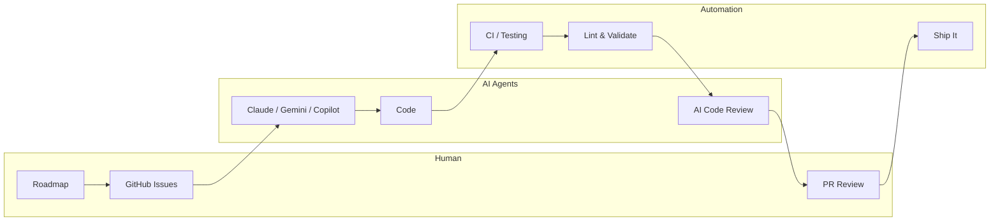

  

  
  
  

---

  

  <picture>
    <source media="(prefers-color-scheme: dark)" srcset="https://raw.githubusercontent.com/JacobPEvans/JacobPEvans/output/github-snake-dark.svg" />
    <source media="(prefers-color-scheme: light)" srcset="https://raw.githubusercontent.com/JacobPEvans/JacobPEvans/output/github-snake.svg" />
    
  </picture>

*Building the pipeline where humans set direction and AI handles the rest.*

*Splunk/Cribl consultant by day. Automating myself out of a job by night.*

---

  
  
  
  
  
  

  

  

  

  
  
  
  

---

### The Mission

The goal: file a GitHub Issue, grab coffee, come back to a PR that's been implemented, tested, and reviewed by multiple AI models — just waiting for a thumbs up. Not fully there yet, but close enough to be dangerous.

Humans decide *what* to build. AI agents handle the *how*. Automation runs the boring parts. A human gives the final sign-off. Claude, Gemini, Copilot, and local MLX models each do what they're best at — the right model for the right job instead of throwing everything at one.

### About Me

**On the Clock:**
Splunk and Cribl consultant specializing in security operations. I architect SIEM platforms, build detection pipelines, and optimize data flows. My specialty? Cutting ingest volume by 30-50% while actually improving security posture.

**Outside the Terminal:**
When I'm not wiring up AI agents or debugging data pipelines, I'm probably over-engineering my home lab or convincing my fish that uptime matters.

**Home Lab:** Proxmox cluster, UniFi networking, Home Assistant, Splunk, Cribl — all managed with Terraform, Ansible, and Nix. The goal is fault-tolerant infrastructure I can rebuild from a single `nix build`.

**Aquariums:** 75-gallon saltwater reef (clownfish, corals, pistol shrimp) + freshwater tanks with custom lighting and wave-maker automations. The fish have better SLOs than most production systems.

**Adventures:** Scuba diving (San Pedro, Belize is my happy place), snowboarding in Michigan and Colorado, hiking, running.

### What I'm Building

**AI Development Pipeline** — I point Claude, Gemini, and Copilot at GitHub Issues and they figure out the rest. Multi-model routing with local MLX fallback for when I don't want to burn cloud tokens on a typo fix.
[ai-assistant-instructions](https://github.com/JacobPEvans/ai-assistant-instructions) ・ [claude-code-plugins](https://github.com/JacobPEvans/claude-code-plugins) ・ [ai-workflows](https://github.com/JacobPEvans/ai-workflows)

**AI Observability** — OTEL pipeline tracking every AI coding interaction from IDE to Splunk. If an AI agent touches code, I know about it — usage, cost, performance, all of it.
[VisiCore_App_for_AI_Observability](https://github.com/JacobPEvans/VisiCore_App_for_AI_Observability) ・ [cc-edge-copilot-otel](https://github.com/JacobPEvans/cc-edge-copilot-otel) ・ [cc-edge-vscode-io](https://github.com/JacobPEvans/cc-edge-vscode-io)

**Nix Reproducible Everything** — Four repos, one goal: `nix build` and walk away. [nix-darwin](https://github.com/JacobPEvans/nix-darwin) for macOS, [nix-ai](https://github.com/JacobPEvans/nix-ai) for AI tooling, [nix-home](https://github.com/JacobPEvans/nix-home) for dev environment, [nix-devenv](https://github.com/JacobPEvans/nix-devenv) for project shells.

**Local LLM Inference** — Running MLX-native models on Apple Silicon because why pay for tokens when you have 128GB of unified memory? Currently on M4 MacBook Pro, eyeing the Mac Studio.
[nix-ai](https://github.com/JacobPEvans/nix-ai) (MLX module)

**RAG & Context Engineering** — Qdrant on the home lab feeding context into AI workflows. The goal: AI that actually knows your codebase instead of hallucinating import paths.

**Home Lab IaC** — Proxmox cluster, 30+ repos, everything in code. Terraform provisions, Ansible configures, Renovate keeps deps fresh, release-please handles versions.
[terraform-proxmox](https://github.com/JacobPEvans/terraform-proxmox) ・ [ansible-proxmox](https://github.com/JacobPEvans/ansible-proxmox) ・ [.github](https://github.com/JacobPEvans/.github) ・ [secrets-sync](https://github.com/JacobPEvans/secrets-sync)

### GitHub Metrics

  

### 3D Contribution Calendar

  

